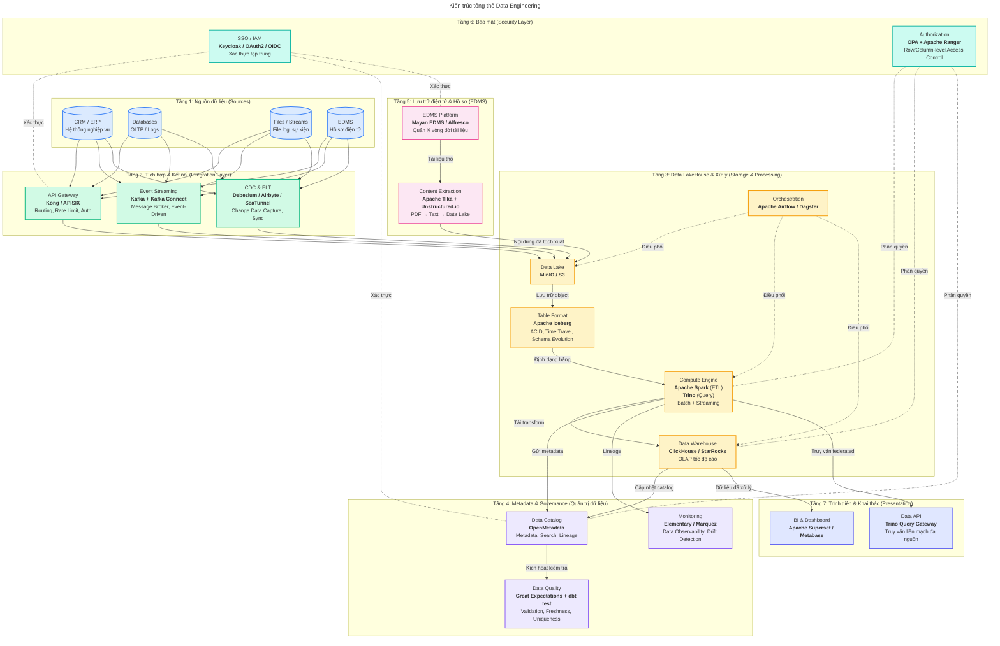

# Mô hình kiến trúc các Layer - Data Engineering nâng cao

> Nguồn: [Research.md](Research.md)

```mermaid
---
title: Kiến trúc tổng thể Data Engineering
---
flowchart TB
    %% ── Định nghĩa style cho từng tầng ──
    classDef sourceStyle    fill:#dbeafe,stroke:#3b82f6,stroke-width:2px
    classDef integStyle     fill:#d1fae5,stroke:#10b981,stroke-width:2px
    classDef processStyle   fill:#fef3c7,stroke:#f59e0b,stroke-width:2px
    classDef governStyle    fill:#ede9fe,stroke:#8b5cf6,stroke-width:2px
    classDef edmsStyle      fill:#fce7f3,stroke:#ec4899,stroke-width:2px
    classDef securityStyle  fill:#ccfbf1,stroke:#14b8a6,stroke-width:2px
    classDef presentStyle   fill:#e0e7ff,stroke:#6366f1,stroke-width:2px
    classDef crossStyle     fill:none,stroke:#94a3b8,stroke-width:1px,stroke-dasharray:8 4

    %% ═══════════════════════════════════════
    %% TẦNG 1: NGUỒN DỮ LIỆU
    %% ═══════════════════════════════════════
    subgraph L1["Tầng 1: Nguồn dữ liệu (Sources)"]
        direction LR
        S1[("CRM / ERP<br/>Hệ thống nghiệp vụ")]
        S2[("Databases<br/>OLTP / Logs")]
        S3[("Files / Streams<br/>File log, sự kiện")]
        S4[("EDMS<br/>Hồ sơ điện tử")]
    end

    %% ═══════════════════════════════════════
    %% TẦNG 2: TÍCH HỢP & KẾT NỐI
    %% ═══════════════════════════════════════
    subgraph L2["Tầng 2: Tích hợp & Kết nối (Integration Layer)"]
        direction LR
        I1["API Gateway<br/><b>Kong / APISIX</b><br/>Routing, Rate Limit, Auth"]
        I2["Event Streaming<br/><b>Kafka + Kafka Connect</b><br/>Message Broker, Event-Driven"]
        I3["CDC & ELT<br/><b>Debezium / Airbyte / SeaTunnel</b><br/>Change Data Capture, Sync"]
    end

    %% ═══════════════════════════════════════
    %% TẦNG 3: DATA LAKEHOUSE & XỬ LÝ
    %% ═══════════════════════════════════════
    subgraph L3["Tầng 3: Data LakeHouse & Xử lý (Storage & Processing)"]
        direction LR
        P1["Orchestration<br/><b>Apache Airflow / Dagster</b>"]
        P2["Data Lake<br/><b>MinIO / S3</b>"]
        P3["Table Format<br/><b>Apache Iceberg</b><br/>ACID, Time Travel, Schema Evolution"]
        P4["Compute Engine<br/><b>Apache Spark</b> (ETL)<br/><b>Trino</b> (Query)<br/>Batch + Streaming"]
        P5["Data Warehouse<br/><b>ClickHouse / StarRocks</b><br/>OLAP tốc độ cao"]
    end

    %% ═══════════════════════════════════════
    %% TẦNG 4: METADATA & GOVERNANCE
    %% ═══════════════════════════════════════
    subgraph L4["Tầng 4: Metadata & Governance (Quản trị dữ liệu)"]
        direction LR
        G1["Data Catalog<br/><b>OpenMetadata</b><br/>Metadata, Search, Lineage"]
        G2["Data Quality<br/><b>Great Expectations + dbt test</b><br/>Validation, Freshness, Uniqueness"]
        G3["Monitoring<br/><b>Elementary / Marquez</b><br/>Data Observability, Drift Detection"]
    end

    %% ═══════════════════════════════════════
    %% TẦNG 5: LƯU TRỮ ĐIỆN TỬ (EDMS)
    %% ═══════════════════════════════════════
    subgraph L5["Tầng 5: Lưu trữ điện tử & Hồ sơ (EDMS)"]
        direction LR
        E1["EDMS Platform<br/><b>Mayan EDMS / Alfresco</b><br/>Quản lý vòng đời tài liệu"]
        E2["Content Extraction<br/><b>Apache Tika + Unstructured.io</b><br/>PDF → Text → Data Lake"]
    end

    %% ═══════════════════════════════════════
    %% TẦNG 6: BẢO MẬT
    %% ═══════════════════════════════════════
    subgraph L6["Tầng 6: Bảo mật (Security Layer)"]
        direction LR
        C1["SSO / IAM<br/><b>Keycloak / OAuth2 / OIDC</b><br/>Xác thực tập trung"]
        C2["Authorization<br/><b>OPA + Apache Ranger</b><br/>Row/Column-level Access Control"]
    end

    %% ═══════════════════════════════════════
    %% TẦNG 7: TRÌNH DIỄN
    %% ═══════════════════════════════════════
    subgraph L7["Tầng 7: Trình diễn & Khai thác (Presentation)"]
        direction LR
        B1["BI & Dashboard<br/><b>Apache Superset / Metabase</b>"]
        B2["Data API<br/><b>Trino Query Gateway</b><br/>Truy vấn liền mạch đa nguồn"]
    end

    %% ═══════════════════════════════════════
    %% LUỒNG DỮ LIỆU CHÍNH
    %% ═══════════════════════════════════════

    %% Tầng 1 → Tầng 2
    S1 & S2 & S3 & S4 --> I1 & I2 & I3

    %% Tầng 2 → Tầng 3
    I1 & I2 & I3 --> P2

    %% Trong Tầng 3
    P1 -.->|Điều phối| P2 & P4 & P5
    P2 -->|Lưu trữ object| P3
    P3 -->|Định dạng bảng| P4
    P4 -->|Tải transform| P5

    %% Tầng 3 → Tầng 4
    P4 -->|Gửi metadata| G1
    P4 -->|Lineage| G3
    P5 -->|Cập nhật catalog| G1
    G1 -->|Kích hoạt kiểm tra| G2

    %% Tầng 5 → Tầng 3 (EDMS tích hợp)
    E1 -->|Tài liệu thô| E2
    E2 -->|Nội dung đã trích xuất| P2

    %% Tầng 6 (Bảo mật xuyên suốt)
    C1 -.-|Xác thực| I1 & G1 & E1
    C2 -.-|Phân quyền| P4 & P5 & G1

    %% Tầng 3 → Tầng 7
    P5 -->|Dữ liệu đã xử lý| B1
    P4 -->|Truy vấn federated| B2

    %% ── Áp dụng class ──
    class S1,S2,S3,S4 sourceStyle
    class I1,I2,I3 integStyle
    class P1,P2,P3,P4,P5 processStyle
    class G1,G2,G3 governStyle
    class E1,E2 edmsStyle
    class C1,C2 securityStyle
    class B1,B2 presentStyle
```
