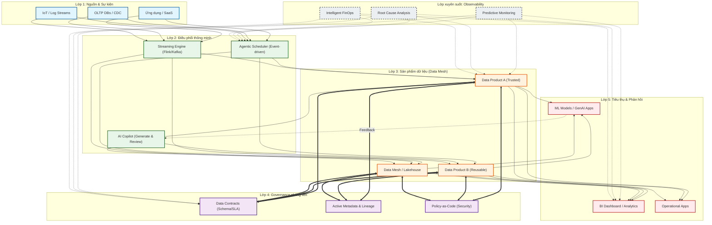

# Data Engineering 2024 → 2027: Từ Đường ống tuyến tính đến Hệ sinh thái dữ liệu nhận thức

> Tài liệu bổ sung cập nhật **2026** đã kiểm chứng (Gartner, Snowflake, dbt Labs, Databricks, Apache Airflow).
> Cập nhật: 2026-06-23.

---

## 0. Luận điểm trung tâm

Để có **bức tranh tổng thể** thay vì những mảnh ghép rời rạc, cần chuyển từ tư duy **"Đường ống tuyến tính" (Linear Pipeline)** sang **"Hệ sinh thái lai ghép, thông minh, vận hành theo vòng đời" (Cognitive Data Ecosystem)**.

Sự chuyển dịch 2024 → 2027 được xác nhận bởi dữ liệu thị trường và dự báo từ **Gartner, IDC, Ventana Research, Snowflake, dbt Labs**. Các con số đều chỉ về một hướng: **AI hóa, tự động hóa, và phân quyền**. Data Engineer 2027 sẽ dành **~61% thời gian cho AI projects**, làm việc với **data products + data mesh**, và dùng **observability như một phần thiết yếu** của pipeline.

---

## 1. Sơ đồ kiến trúc tổng thể (Mô hình 2027)

---

## 2. Phân tích 5 lớp của bức tranh tổng thể

### 🟦 Lớp 1: Nguồn & Sự kiện (Thay cho "Kéo dữ liệu thụ động")
- **Tư duy mới**: Không còn chạy query lúc 2h sáng để kéo dữ liệu. Hệ thống **lắng nghe sự thay đổi** (Change Data Capture – CDC).
- **Vai trò DE**: Cấu hình cơ chế lắng nghe (Debezium, Kafka Connect) thay vì viết script kéo.

### 🟩 Lớp 2: Điều phối thông minh (Thay cho "Cron jobs & Scripts thủ công")
- **Tư duy mới**: Workflow **kích hoạt theo sự kiện** (dữ liệu vừa tới là xử lý). AI không chỉ transform mà còn **tự đề xuất tối ưu partition/join**.
- **Vai trò DE**: Làm việc với **AI Agents** để review code AI sinh ra, tập trung logic nghiệp vụ phức tạp.

### 🟧 Lớp 3: Sản phẩm & Mesh (Thay cho "Bảng/Báo cáo dùng 1 lần")
- **Tư duy mới**: Dữ liệu đóng gói thành **"Sản phẩm"** có tên, phiên bản, SLA rõ ràng, được **Domain team** sở hữu thay vì một team trung tâm (kiến trúc **Data Mesh**).
- **Vai trò DE**: Xây nền tảng (Platform) để domain team tự publish → DE chuyển sang **Internal Data Platform Engineer**.

### 🟪 Lớp 4: Governance nhúng liền (Thay cho "Kiểm tra cuối tháng")
- **Tư duy mới**: Không áp governance sau khi pipeline đã chạy. Data Quality, Lineage, Security khai báo ngay tại định nghĩa pipeline (dưới dạng **Data Contracts**).
- **Vai trò DE**: Viết **Policy-as-Code** (Open Policy Agent), schema mới deploy là tự có lineage + quality checks.

### 🟥 Lớp 5: Tiêu thụ & Vòng phản hồi (Thay cho "Giao dữ liệu xong là hết")
- **Tư duy mới**: Khi ML/GenAI tiêu thụ dữ liệu, chúng **trả về feedback** về chất lượng/ngữ cảnh để pipeline tự điều chỉnh (vd: tăng tần suất cập nhật bảng được truy vấn nhiều).
- **Vai trò DE**: Hiểu **MLOps** và **RAG** để thiết kế ngược pipeline từ đầu ra.

### 🔲 Lớp xuyên suốt: Observability (Thay cho "Monitoring cục bộ")
- **Tư duy mới**: Monitor cho biết "Pipeline chết lúc 3h". Observability cho biết **"Tại sao chết"** và **"Sắp chết khi nào"** (volume anomaly, schema drift).
- **Vai trò DE**: Dùng OpenTelemetry, tích hợp Metrics khắp các lớp, đọc biểu đồ **SLO**.

---

## 3. Năm xu hướng cốt lõi (bài viết tham khảo + GitHub repos)

### 3.1 AI-Enhanced Pipelines (AI hóa Pipeline)

| Bài viết | Nội dung chính |
|----------|----------------|
| **"The E(G)TL Model"** – MDPI (2024) | Mô hình **EGTL** (Extract, **Generate**, Transform, Load) – chèn bước GenAI vào ETL truyền thống. Thử nghiệm đạt **93%** thành công trên 5 cấp độ khó |
| **"AI-Powered ETL Pipeline Orchestration"** – ODSC | Lộ trình: cron jobs → DAGs (Airflow) → cloud-native → **multi-agent AI systems** cộng tác |
| **Forte Group (2024)** | AI tự động hóa tác vụ lặp trong ETL, giám sát pipeline, xác thực dữ liệu |
| **CIO.com – "The future of streaming data platforms" (2026)** | Tầm nhìn **"agentic mesh"** – AI agents tự đọc API docs, suggest schema, generate code (PySpark/SQL), deploy trong vài phút. DE chuyển từ **người viết → người review** |

**GitHub Repos:**

| Repository | Mô tả |
|------------|-------|
| [NVIDIA/physicsnemo-curator](https://github.com/NVIDIA/physicsnemo-curator) | Accelerated ETL toolkit xây dataset AI-ready (CAE, weather/climate, molecular dynamics) |
| [HotTechStack/simple-dataengineering-ai-stack](https://github.com/HotTechStack/simple-dataengineering-ai-stack) | Dockerized blueprints spin-up end-to-end env (data lake, orchestration, observability, AI tooling) |
| [shsharifi/trust-graph-framework](https://github.com/shsharifi/trust-graph-framework) | Orchestration LLM + context engineering, kết nối data silos thành knowledge AI-ready |

### 3.2 Data Products & Mesh

| Bài viết | Nội dung chính |
|----------|----------------|
| **Matt Aslett – "Data as a Product" (Ventana Research)** | Dự đoán **>60% doanh nghiệp** áp dụng "data as a product" vào 2027. Nhấn mạnh **data contracts** |
| **Alation – "2026 Data Management Trends"** | Data products thành **standard delivery model**; data mesh phân quyền cho domain teams; data fabric tự động hóa quản lý |
| **Springer – Data Product, Data Mesh, Data Fabric** | Phân tích 3 khái niệm khắc phục "failure modes of data management" |
| **Market Research – Data Mesh Forecast** | **$1.50B (2024) → $4.87B (2032)**, CAGR 15.80% |

**GitHub Repos:**

| Repository | Mô tả |
|------------|-------|
| [redbco/redb-open](https://github.com/redbco/redb-open) | Distributed data mesh: truy cập/migration/replication real-time across DBs; mesh overlay network |
| [aws/modern-data-architecture-accelerator](https://github.com/aws/modern-data-architecture-accelerator) | Build/manage pipelines, lakes, warehouses pre-configured & compliant trên AWS |

### 3.3 Event-Driven Orchestration & Real-time

| Bài viết | Nội dung chính |
|----------|----------------|
| **VentureBeat – "Apache Airflow 3.0" (2025)** | Bản lớn nhất 4 năm: **event-driven scheduling**, distributed client model, đa cloud/đa ngôn ngữ |
| **MDPI – "Event-Driven Data Orchestration" (2025)** | Mô hình modular 3 phần: production / transfer / consumption; thêm **buffering** (async) + **notification** (real-time alerts) |
| **Forte Group (2024)** | Real-time quan trọng trong finance, e-commerce, healthcare; **Kafka + Flink** dẫn đầu |

**GitHub Repos:**

| Repository | Mô tả |
|------------|-------|
| [theoddden/Mandala](https://github.com/theoddden/Mandala) | Event-sourced logistics bridge, chuẩn hóa fleet telemetry/customs/rail vào canonical event schema |
| [nkwork9999/duck-orch](https://github.com/nkwork9999/duck-orch) | Asset-centric orchestration (lineage, partitions, sensor loop) đóng gói thành DuckDB extension |

### 3.4 Data Quality & Governance Built-in

| Bài viết | Nội dung chính |
|----------|----------------|
| **Nasscom (2024)** | Governance thiết lập guidelines cho quality (accuracy, completeness, timeliness); quality controls trong pipeline → **phát hiện sớm** |
| **Data Engineering Digest (2024)** | Quality + governance là **top data integrity challenges**; 58% DN báo cáo cải thiện analytics nhờ governance |
| **Lightup.ai (2024)** | **Decentralizing** quality tasks – nhiều người viết checks/rules/alerts + root cause analysis |
| **IBM – Cost of poor data quality** | DN mất **$3.1 nghìn tỷ USD/năm**; chi phí trung bình 1 data breach 2024 là **$4.88 triệu** |

> Repos: chưa có repo chuyên built-in governance nổi bật; thực tế dùng **Great Expectations, Soda, dbt tests** tích hợp vào pipeline để thực thi quality checks.

### 3.5 Observability & Insights

| Bài viết | Nội dung chính |
|----------|----------------|
| **IBM Blog – "Data Observability" (2024)** | Chuyển từ **"firefighting" → prevention**: phát hiện bottlenecks, tối ưu resource, xác định lineage gaps |
| **Precisely (2025)** | Dự đoán **70% DN** áp dụng observability tools vào 2027 (từ ~50% năm 2025) |
| **Gartner** | **50% DN** áp dụng observability vào 2026 (từ <20% năm 2024) — *xác nhận 2026, xem §4* |
| **Market Research – Pipeline Observability** | **$828M (2024) → $1.684B (2031)**, CAGR 10.7% |

---

## 4. Cập nhật 2026 (đã kiểm chứng) — điều gì đã thật sự xảy ra

### 4.1 Agentic Data Pipelines & Self-Healing
- 2026 là năm **agentic data pipelines** thành chủ đạo: AI agents **observe → reason → act → learn** theo thời gian thực, tự xử lý lỗi, tự cải thiện.
- **Self-healing pipelines** là payoff trực tiếp: agent tự phát hiện và sửa sự cố, giải phóng phần lớn thời gian DE. ([ishir](https://www.ishir.com/blog/320917/agentic-data-pipelines-the-shift-to-autonomous-data-engineering.htm), [Medium – self-healing](https://medium.com/ai-analytics-diaries/self-healing-data-pipelines-with-agentic-ai-the-biggest-trend-data-scientists-cant-ignore-in-2026-9bb9c17c59f7))

### 4.2 AI là "người tiêu thụ dữ liệu" chính (Data for Machine Users)
- Một phần lớn data consumer 2026 là **AI agents** — cần tự discover/understand/utilize dữ liệu không cần con người. Kéo theo **metadata-driven architectures** và **context engineering** lên hàng tài sản cốt lõi. ([Datafold 12 predictions](https://www.datafold.com/blog/data-engineering-in-2026-predictions/), [Ben Lorica](https://gradientflow.substack.com/p/data-engineering-for-machine-users))

### 4.3 Công cụ vendor đã ra mắt (lấp khoảng trống "AI Copilot" ở Lớp 2)
- **Databricks Lakeflow** — "kỷ nguyên agentic data engineering"; **Genie Code** (3/2026). ([Databricks](https://www.databricks.com/blog/lakeflow-new-era-agentic-data-engineering))
- **Snowflake Cortex Code / CoCo** — AI coding agent cho modern data stack; **Smart Pipelines**. ([Snowflake CoCo](https://www.snowflake.com/en/blog/snowflake-coco-ai-coding-agent-modern-data-stack/), [Smart Pipelines](https://www.snowflake.com/en/blog/ai-smart-pipelines-whats-new/))
- **MCP (Model Context Protocol)** thành chuẩn nối AI agent ↔ tool (GitHub, Jira, Confluence, dbt) trong data stack.

### 4.4 Apache Airflow 3 — event-driven đã GA
- Airflow 3 **Generally Available** (bản lớn nhất lịch sử). **AssetWatcher** phản ứng tức thì với file arrival/API/pub-sub; **MessageQueueTrigger** hỗ trợ **Amazon SQS + Apache Kafka** out-of-the-box. Dòng 3.x đã tới **3.2.x**. Airflow Summit 2026: 31/8–2/9 tại Austin, TX. ([Airflow blog](https://airflow.apache.org/blog/airflow-three-point-oh-is-here/), [event-scheduling docs](https://airflow.apache.org/docs/apache-airflow/stable/authoring-and-scheduling/event-scheduling.html))

### 4.5 Governance: Policy-as-Code + Open Table Formats (Lớp 4)
- Lakehouse governance vận hành 3 mức tại **query time**: **column-level masking**, **row-level filters**, **object-level policies**; intent ở org-level, refine ở domain/table-level. ([Policy as Code](https://datalakehousehub.com/blog/2026-05-policy-as-code-governance/))
- **Automated Data Contracts** thành standard practice — "digital handshake" producer ↔ consumer, enforce quality/privacy/security trước khi trao đổi.
- **Apache Iceberg / Delta Lake / Apache Hudi** là lớp abstraction chuẩn: store-once, query-by-many-engines, không vendor lock-in. Databricks ra **LTAP** (Lake Transactional/Analytical Processing) — governance hợp nhất trên open format. ([Cloudera 2026](https://www.cloudera.com/blog/business/2026-predictions-the-architecture-governance-and-ai-trends-every-enterprise-must-prepare-for.html))

### 4.6 Observability — từ "nice-to-have" → "tactical necessity"
- **Gartner 2026 Market Guide**: theo *2025 State of AI-Ready Data Survey*, **53%** D&A leaders đã triển khai observability, **+31%** sẽ deploy trong 6–12 tháng, **+12%** trong 12–18 tháng → gần như **toàn thị trường trong 2 năm**.
- Thị trường observability: **$346.4M (2024, +20.8%) → $3.51B (2026) → $6.03B (2031)**.
- Xác nhận mốc cũ: **50% DN** kiến trúc phân tán dùng observability vào **2026** (từ ~20% năm 2024). Driver số 1 là **AI workloads**. ([Monte Carlo](https://montecarlo.ai/blog-what-2026-gartner-market-guide-for-data-observability-tools-means-for-your-data-and-ai-team-my-take/), [Revefi](https://www.revefi.com/blog/what-is-data-observability))

### 4.7 Ưu tiên của ngành 2026: Trust & Speed (dbt Labs)
- *2026 State of Analytics Engineering* (dbt Labs, 363 respondents, 12/2025–02/2026): "**tăng trust trong dữ liệu**" lên **83%** (từ 66% năm 2025); "**speed**" lên **71%** (từ 50%). dbt là table-stakes cho transformation; MCP mở rộng hệ sinh thái. ([dbt Labs](https://www.getdbt.com/resources/state-of-analytics-engineering-2026))

---

## 5. Bảng tổng hợp số liệu dự báo (2024–2032)

| Xu hướng | Số liệu dự báo | Trạng thái | Nguồn |
|----------|---------------|-----------|-------|
| Data Mesh Market | $1.50B (2024) → $4.87B (2032), CAGR 15.80% | — | Market Research |
| Data Observability Adoption (kiến trúc phân tán) | <20% (2024) → **50% (2026)** | ✅ xác nhận | Gartner |
| Data Observability Adoption (tổng) | ~50% (2025) → 70% (2027); thực tế 2025: **53% đã triển khai** | ⬆️ vượt dự báo | Precisely / Gartner 2026 |
| Data Observability Market | $346.4M (2024) → **$3.51B (2026)** → $6.03B (2031) | mới | Gartner / industry |
| Data Pipeline Observability Market | $828M (2024) → $1.684B (2031), CAGR 10.7% | — | QY Research |
| Data as a Product Adoption | >60% doanh nghiệp (2027) | — | Ventana Research |
| DE time on AI projects | 19% (2023) → **37% (2026)** → **61% (2027)** | ✅ xác nhận | MIT Tech Review / Snowflake |
| "Trust in data" là ưu tiên | 66% (2025) → **83% (2026)** | mới | dbt Labs |
| "Speed" là ưu tiên | 50% (2025) → **71% (2026)** | mới | dbt Labs |

---

## 6. So sánh bức tranh (2024 🆚 2027)

| Khía cạnh | Mô hình cũ (2024) – *Đường ống* | Mô hình mới (2027) – *Hệ sinh thái* |
| :--- | :--- | :--- |
| **Hình dạng kiến trúc** | Tuyến tính (Nguồn → Xử lý → Đích) | **Vòng lặp khép kín** (Thu nhận → Mesh → Phản hồi) |
| **Trạng thái dữ liệu** | Tĩnh (Batch theo giờ) | **Động** (Real-time & Sự kiện) |
| **Xử lý lỗi** | Reactive (chờ log báo lỗi) | **Proactive** (AI phát hiện bất thường + self-healing) |
| **Giao tiếp** | Schema ngầm định | **Data Contracts** (ràng buộc 2 chiều, tự động) |
| **Người tiêu thụ** | Con người (BI/báo cáo) | Con người **+ AI agents** (machine users) |
| **Vai trò DE** | "Thợ sửa ống nước" (Tool-focused) | **"Người điều phối trí tuệ"** (Outcome-focused, review AI) |

---

## 7. Kết luận

Đến 2027, Data Engineer **không đứng giữa luồng dữ liệu để kéo và đẩy**, mà đứng **phía trên** toàn bộ luồng: thiết kế "luật chơi" (Data Contracts, Policy-as-Code), dạy/review AI cách xử lý, và đảm bảo **vòng phản hồi** từ đầu ra (ML/GenAI) gửi ngược lại cải tiến đầu vào. Đây là bức tranh của một **Cỗ máy tự vận hành (Autonomous Data Fabric)**.

Cập nhật 2026 cho thấy xu hướng đã **đi nhanh hơn dự báo**: agentic + self-healing pipelines đã có sản phẩm thật (Lakeflow, Cortex Code), observability vượt mốc Gartner, AI agents trở thành consumer chính, và Iceberg/Delta + Policy-as-Code đã thành nền tảng governance. Tài nguyên thực hành ngay: **AI-accelerated ETL** (NVIDIA Curator), **data mesh** (reDB), **event-driven orchestration** (duckOrch + Airflow 3 AssetWatcher), **end-to-end AI data stack** (simple-dataengineering-ai-stack).

---

## 8. Nguồn tham khảo (2026, đã kiểm chứng)

- Datafold — *Data Engineering in 2026: 12 Predictions* — https://www.datafold.com/blog/data-engineering-in-2026-predictions/
- ishir — *Agentic Data Pipelines: AI-Driven Autonomous Data Engineering in 2026* — https://www.ishir.com/blog/320917/agentic-data-pipelines-the-shift-to-autonomous-data-engineering.htm
- Databricks — *Lakeflow: A new era of agentic data engineering* — https://www.databricks.com/blog/lakeflow-new-era-agentic-data-engineering
- Snowflake — *CoCo: AI Coding Agent for the Modern Data Stack* — https://www.snowflake.com/en/blog/snowflake-coco-ai-coding-agent-modern-data-stack/
- Apache Airflow — *Airflow 3 is Generally Available* — https://airflow.apache.org/blog/airflow-three-point-oh-is-here/
- Apache Airflow — *Event-driven scheduling docs* — https://airflow.apache.org/docs/apache-airflow/stable/authoring-and-scheduling/event-scheduling.html
- Monte Carlo — *2026 Gartner Market Guide for Data Observability: My Take* — https://montecarlo.ai/blog-what-2026-gartner-market-guide-for-data-observability-tools-means-for-your-data-and-ai-team-my-take/
- Datalakehouse Hub — *Policy as Code for Lakehouse Governance* — https://datalakehousehub.com/blog/2026-05-policy-as-code-governance/
- Cloudera — *2026 Data Architecture, Governance & AI Trends* — https://www.cloudera.com/blog/business/2026-predictions-the-architecture-governance-and-ai-trends-every-enterprise-must-prepare-for.html
- dbt Labs — *2026 State of Analytics Engineering Report* — https://www.getdbt.com/resources/state-of-analytics-engineering-2026

---

## 9. Câu hỏi chưa giải quyết

- Mô hình **EGTL (93% success)** mới ở mức nghiên cứu (MDPI 2024) — chưa có benchmark production 2026 để xác nhận con số này có giữ vững ở quy mô lớn.
- Dự báo **Data Mesh $4.87B (2032)** và **Data as a Product >60% (2027)** chưa có nguồn 2026 cập nhật lại — giữ nguyên theo bản gốc, cần re-verify khi có báo cáo Ventana/Market Research mới.
</content>
</invoke>
