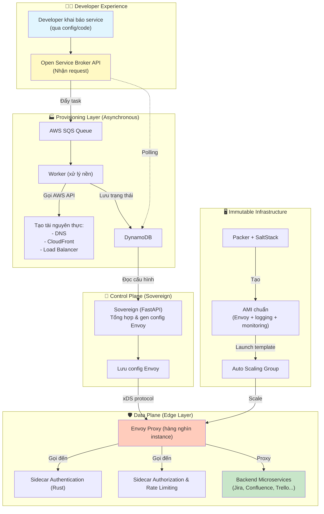

Rất tốt, tôi sẽ vẽ cho bạn một sơ đồ tổng quan về **Edge Infrastructure của Atlassian** dựa trên nội dung đã phân tích. Sơ đồ này dùng ký pháp Mermaid, bạn có thể copy vào bất kỳ editor hỗ trợ (như Notion, GitHub, hoặc công cụ online) để xem trực quan.

### Giải thích luồng chính

1. **Developer** khai báo nhu cầu → **OSB API** nhận request.
2. OSB không xử lý đồng bộ mà đẩy task vào **SQS**, worker phía sau tạo tài nguyên AWS. Kết quả lưu vào **DynamoDB** (developer có thể poll để biết khi nào xong).
3. **Sovereign** (control plane) đọc cấu hình từ DynamoDB, sinh config Envoy và đẩy xuống các proxy qua giao thức **xDS** (hot reload).
4. **Envoy proxy** nhận traffic từ internet, gọi các **sidecar** (auth, rate limit) rồi mới forward đến **backend microservice** thật.
5. Toàn bộ proxy instance được tạo từ **AMI chuẩn** (Packer + SaltStack) và quản lý bởi **Auto Scaling Group** – khi hỏng, instance bị xóa và thay bằng instance mới hoàn toàn (immutable).

Bạn cần tôi giải thích thêm chi tiết một thành phần nào không? Hoặc bạn muốn export sơ đồ này sang dạng ảnh?
