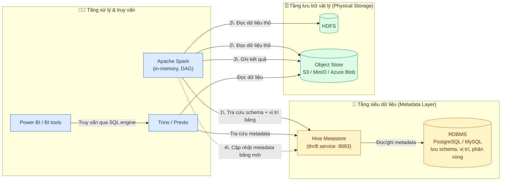

Để xây dựng một pipeline dữ liệu, việc hiểu rõ vai trò của từng thành phần trong hệ sinh thái Hadoop và Spark là rất quan trọng. Hãy cùng phân tích `Hive Metastore`, `Hadoop`, `Spark`, và cách chúng phối hợp trong một `data store layer` (tầng lưu trữ dữ liệu).

### 🧠 Định nghĩa các thành phần

#### Apache Hadoop: Nền tảng lưu trữ và xử lý phân tán

Hadoop là một nền tảng mã nguồn mở cho phép lưu trữ và xử lý các bộ dữ liệu cực lớn trên một cụm máy chủ thông thường (commodity hardware). Nó nổi tiếng với khả năng mở rộng và chịu lỗi cao. Các thành phần cốt lõi của Hadoop bao gồm:

* **HDFS (Hadoop Distributed File System)**: Hệ thống tệp phân tán, là nơi lưu trữ dữ liệu chính. Nó chia dữ liệu thành các khối (block) và sao chép chúng trên nhiều máy chủ để đảm bảo an toàn và hiệu suất cao.
* **MapReduce**: Mô hình lập trình để xử lý dữ liệu song song trên cụm. Nó hoạt động theo kiểu **disk-based** (dựa trên đĩa cứng), nghĩa là dữ liệu trung gian được ghi xuống đĩa, khiến cho các tác vụ phức tạp, đặc biệt là các phép toán lặp đi lặp lại, bị chậm.
* **YARN (Yet Another Resource Negotiator)**: Bộ điều phối tài nguyên, có nhiệm vụ quản lý và phân bổ tài nguyên (CPU, RAM) cho các ứng dụng chạy trên cụm Hadoop.

#### Apache Spark: Công cụ xử lý dữ liệu nhanh

Spark cũng là một nền tảng xử lý dữ liệu phân tán, nhưng nó vượt trội hơn Hadoop MapReduce ở tốc độ nhờ cơ chế **in-memory processing** (xử lý trên bộ nhớ RAM).

* **Hiệu năng**: Spark lưu dữ liệu trung gian trên RAM, giúp tăng tốc đáng kể cho các tác vụ phân tích, học máy và xử lý lặp lại. Nó thường nhanh hơn MapReduce tới 100 lần cho một số tác vụ nhất định.
* **Tính linh hoạt**: Spark cung cấp các API mạnh mẽ và dễ sử dụng cho Java, Scala, Python và R, cùng các thư viện tích hợp cho SQL, stream processing và machine learning (MLlib). Nó xây dựng một **DAG (Directed Acyclic Graph)** cho toàn bộ công việc, cho phép tối ưu hóa và thực hiện một luồng xử lý phức tạp trong một chương trình duy nhất, thay vì phải chia nhỏ thành nhiều job MapReduce.

#### Hive Metastore: "Bộ não" siêu dữ liệu

Hive Metastore không lưu trữ dữ liệu, mà là một **kho lưu trữ siêu dữ liệu** (metadata repository) cho hệ sinh thái Hadoop và Spark. Nó đóng vai trò như một danh mục (catalog) tập trung chứa thông tin về:

* **Cấu trúc bảng**: Tên bảng, tên cột, kiểu dữ liệu.
* **Vị trí lưu trữ**: Đường dẫn đến dữ liệu trong HDFS, S3, v.v.
* **Thông tin phân vùng**: Cách dữ liệu được chia nhỏ để tối ưu truy vấn.

Thay vì mỗi công cụ (Spark, Hive, Presto) tự quản lý siêu dữ liệu, chúng đều kết nối đến Hive Metastore. Điều này cho phép các công cụ khác nhau chia sẻ cùng một định nghĩa dữ liệu. Ví dụ, bạn có thể tạo một bảng bằng Hive và sau đó Spark cũng có thể truy vấn bảng đó mà không cần khai báo lại.

Về mặt kỹ thuật, Hive Metastore thường chạy như một dịch vụ riêng và lưu trữ dữ liệu siêu của nó trong một cơ sở dữ liệu quan hệ (như MySQL, PostgreSQL), chứ không phải trong HDFS.

### 🗄️ Data Store Layer: Kiến trúc lưu trữ

Khi bạn kết hợp ba thành phần này, tầng lưu trữ và xử lý dữ liệu sẽ vận hành như sau:

1. **Lớp lưu trữ vật lý (Physical Storage)**: Đây là nơi dữ liệu thực sự được lưu giữ. Nó thường là các hệ thống tệp phân tán (ví dụ: **HDFS**) hoặc các kho lưu trữ đối tượng (ví dụ: **Amazon S3, Azure Blob Storage**). Hadoop và Spark đều có thể đọc/ghi dữ liệu từ các nguồn này.
2. **Lớp siêu dữ liệu (Metadata Layer)**: Đây là nơi **Hive Metastore** "ngự trị". Nó lưu trữ thông tin mô tả dữ liệu, cho phép các công cụ khác nhau truy cập dữ liệu với cùng một "bản đồ".

Hãy tưởng tượng một thư viện khổng lồ:

* **HDFS/S3**: Là những cuốn sách được xếp trên giá (dữ liệu thô).
* **Hive Metastore**: Là hệ thống thẻ mục lục và danh mục cho biết cuốn sách nào ở kệ nào, tác giả là ai, có bao nhiêu trang (siêu dữ liệu).
* **Spark**: Là bạn đọc hoặc thủ thư có thể nhanh chóng tìm, tra cứu và xử lý mọi cuốn sách. Bạn không cần phải nhớ hết mọi cuốn sách nằm ở đâu mà chỉ cần tra thẻ mục lục (Hive Metastore).

Trong luồng xử lý của bạn:

* Spark sẽ kết nối đến Hive Metastore để biết các bảng dữ liệu nằm ở đâu, có cấu trúc thế nào.
* Spark đọc dữ liệu thô từ HDFS/S3 và thực hiện các phép biến đổi mạnh mẽ trong bộ nhớ.
* Kết quả có thể được ghi trở lại HDFS/S3, và Spark sẽ cập nhật siêu dữ liệu cho bảng kết quả đó vào Hive Metastore để các công cụ khác (như Power BI, Presto) có thể tìm thấy và truy vấn.

Tóm lại, Hadoop cung cấp nền tảng lưu trữ và xử lý cơ bản, Spark là công cụ xử lý nhanh và mạnh mẽ, còn Hive Metastore đóng vai trò là "chất keo" kết nối các tầng lại với nhau, cung cấp một tầng trừu tượng hóa dữ liệu thống nhất và cho phép toàn bộ hệ sinh thái vận hành trơn tru.

### 🔄 Mô hình hoạt động

Sơ đồ dưới đây mô tả cách các thành phần phối hợp: công cụ xử lý (Spark) tra cứu **siêu dữ liệu** ở Hive Metastore để biết bảng nằm ở đâu, rồi đọc/ghi **dữ liệu thô** trực tiếp trên tầng lưu trữ (HDFS/S3), và cập nhật lại metadata sau khi ghi để các công cụ khác (Trino, Power BI) cùng truy vấn.

**Luồng đánh số trong sơ đồ:**

1. Spark hỏi Hive Metastore "bảng này ở đâu, cấu trúc ra sao?" — chỉ trao đổi *metadata*, không phải dữ liệu.
2. Spark đọc dữ liệu thô trực tiếp từ HDFS/S3 vào RAM để xử lý (in-memory).
3. Spark ghi kết quả biến đổi trở lại tầng lưu trữ (thường là S3/HDFS).
4. Spark cập nhật metadata của bảng kết quả vào Hive Metastore, để Trino/Power BI có thể tìm thấy và truy vấn bảng đó mà không cần khai báo lại.
