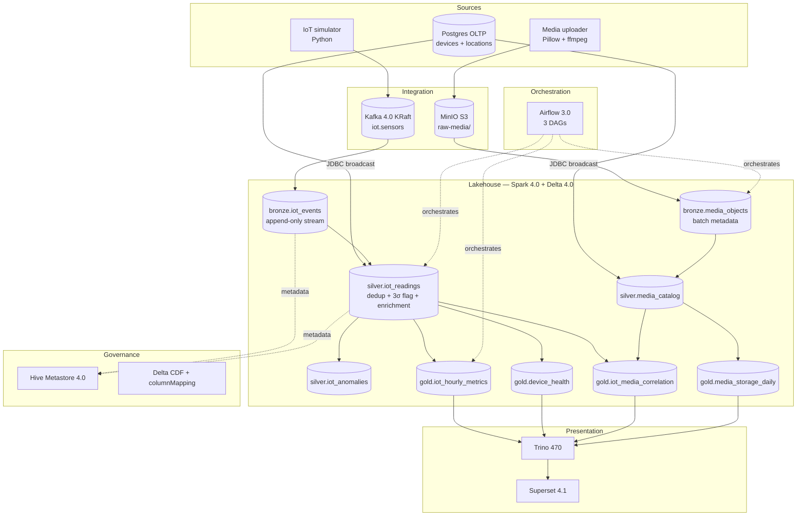

# POC Architecture — Hybrid Lakehouse for IoT + Image + Video

A thin **vertical slice** of the enterprise 7-layer architecture in [../../knowledge/architecture-layer-diagram.md](../../knowledge/architecture-layer-diagram.md), specialised for three new payload classes: IoT telemetry, images, and videos. The goal is to prove they can share one lakehouse table format, one compute engine, and one federated query path — reproducibly via `docker-compose` on a laptop.

## Pipeline

## sample-poc vs sample-poc-hybrid

| Aspect | `sample-poc` (Rust-accelerated) | `sample-poc-hybrid` (Spark/Delta) |
|--------|--------------------------------|------------------------------------|
| Compute engine | Polars (Rust) | Apache Spark 4.0 (Scala/JVM) |
| Table format | Apache Iceberg | Delta Lake 4.0 |
| Catalog | Lakekeeper (Rust) | Hive Metastore 4.0 (UC OSS profile available) |
| Streaming | — (batch only) | Spark Structured Streaming on Kafka 4.0 KRaft |
| Payloads | OLTP e-commerce | IoT + image + video |
| ML extension hook | — | Out-of-scope for POC; deferred to plan |
| Airflow | LocalExecutor (2.x style) | LocalExecutor (Airflow 3.0 task SDK) |
| BI | Superset (Iceberg via Trino) | Superset (Delta via Trino) |

## What's intentionally out of scope

- EDMS layer (L5) — no Mayan/Alfresco integration.
- Real CDC from operational sources — synthetic OLTP via Faker is enough.
- ML inference (YOLO/Whisper) on images/videos — see `decisions/003-no-ml-inference-in-poc.md`.
- Multi-tenant security, Keycloak SSO, Ranger row/column policies.
- Production-grade Kafka HA — single combined-mode KRaft node.
- Cloud deployment — bake-off targets the laptop.

## Sources of truth

- Plan: [`../plan.md`](../plan.md) — 9 phases, Validation Log, code-review history.
- Code-review reports: [`../plans/reports/`](../plans/reports/) — per-phase adversarial reviews.
