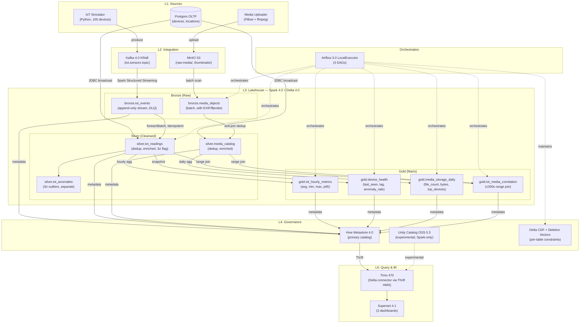

# System Architecture — Hybrid Lakehouse POC

Complete technical architecture mapping, data flows, and medallion contracts for Spark 4.0 + Delta Lake 4.0 + Kafka 4.0 KRaft.

## Architecture Diagram



## Layer Mapping to 7-Tier Reference

| Layer | Reference Component | POC Implementation | Tool |
|-------|---------------------|-------------------|------|
| **L1: Sources** | E-commerce OLTP | IoT simulator, media uploader, Postgres OLTP | Python 3.12, Pillow, ffmpeg |
| **L2: Integration** | Kafka + file ingestion | Kafka 4.0 KRaft topic + MinIO S3 | Kafka, MinIO |
| **L3: Lakehouse** | Bronze/Silver/Gold | Spark 4.0 + Delta 4.0 with medallion | Spark 4.0, Delta Lake 4.0 |
| **L4: Governance** | Catalog + schema enforcement | Hive Metastore 4.0 (primary); UC OSS 0.3 experimental | HMS, UC OSS |
| **L5: EDMS** | Document management | Out of scope for POC | — |
| **L6: Security** | Auth/policies | MinIO IAM basic; Keycloak optional | MinIO, (Keycloak) |
| **L7: Presentation** | BI dashboards | Trino 470 + Superset 4.1 | Trino, Superset |

## Medallion Contract: Bronze → Silver → Gold

### Bronze Layer

**Purpose:** Immutable raw data capture with metadata.

| Table | Source | Partition | Idempotency | Retention |
|-------|--------|-----------|-------------|-----------|
| `bronze.iot_events` | Kafka stream | `event_date` | txnAppId + txnVersion (batch_id) | RETAIN 90 days |
| `bronze.iot_events_dlq` | Parse failures | `error_date` | Append-only, separate DLQ | RETAIN 90 days |
| `bronze.media_objects` | MinIO batch | `ingestion_date` | Anti-join on (object_key, etag) | RETAIN 365 days |

**Schema Contract (bronze.iot_events):**
```sql
CREATE TABLE bronze.iot_events (
  event_id STRING NOT NULL,               -- ULID, globally unique
  device_id STRING NOT NULL,              -- FK to devices.device_id
  sensor_id STRING NOT NULL,              -- e.g., "temp_c", "humidity_pct"
  event_ts TIMESTAMP NOT NULL,            -- Event timestamp
  value DOUBLE NOT NULL,                  -- Sensor reading
  unit STRING NOT NULL,                   -- e.g., "celsius", "percent"
  raw_payload STRING,                     -- Original JSON for audit trail
  ingestion_ts TIMESTAMP NOT NULL,        -- When Spark received it
  invalid_record BOOLEAN NOT NULL DEFAULT FALSE,  -- Parse error flag
  _change_type STRING,                    -- Delta CDF marker
  _commit_version LONG                    -- Delta version
)
USING DELTA
PARTITIONED BY (event_date DATE GENERATED ALWAYS AS (CAST(event_ts AS DATE)))
TBLPROPERTIES (
  'delta.minReaderVersion' = '3',
  'delta.minWriterVersion' = '8',
  'delta.enableChangeDataFeed' = 'true',
  'delta.columnMapping.mode' = 'name'
)
```

**Schema Contract (bronze.media_objects):**
```sql
CREATE TABLE bronze.media_objects (
  object_key STRING NOT NULL,             -- S3 path (e.g., "raw-media/device-0042/photo.jpg")
  mime_type STRING NOT NULL,              -- e.g., "image/jpeg", "video/mp4"
  file_size_bytes LONG NOT NULL,          -- File size on disk
  etag STRING NOT NULL,                   -- S3 ETag (modtime + '-' + length)
  exif_data MAP<STRING, STRING>,          -- EXIF metadata (if present)
  exif_error STRING,                      -- EXIF extraction error (if any)
  ffprobe_data MAP<STRING, STRING>,       -- ffprobe JSON (if video)
  ffprobe_error STRING,                   -- ffprobe extraction error (if any)
  thumbnail_path STRING,                  -- S3 path to generated thumbnail
  ingestion_ts TIMESTAMP NOT NULL,        -- When Spark processed
  _change_type STRING,
  _commit_version LONG
)
USING DELTA
PARTITIONED BY (ingestion_date DATE GENERATED ALWAYS AS (CAST(ingestion_ts AS DATE)))
TBLPROPERTIES (
  'delta.minReaderVersion' = '3',
  'delta.minWriterVersion' = '8',
  'delta.enableChangeDataFeed' = 'true'
)
```

### Silver Layer

**Purpose:** Deduplicated, cleansed, business-logic-ready data.

| Table | Source | Merge Key | Idempotency | Update Trigger |
|-------|--------|-----------|-------------|-----------------|
| `silver.iot_readings` | bronze.iot_events | event_id | MERGE on event_id, update if newer ingestion_ts | Hourly batch |
| `silver.iot_anomalies` | silver.iot_readings (3σ outliers) | anomaly_id | Append-only (new anomalies only) | Hourly batch |
| `silver.media_catalog` | bronze.media_objects | object_key | MERGE on object_key, update if newer ingestion_ts | Hourly batch |

**Schema Contract (silver.iot_readings):**
```sql
CREATE TABLE silver.iot_readings (
  event_id STRING NOT NULL,
  device_id STRING NOT NULL,
  sensor_id STRING NOT NULL,
  event_ts TIMESTAMP NOT NULL,
  value DOUBLE NOT NULL,
  unit STRING NOT NULL,
  device_location_id STRING,              -- Joined from devices.location_id
  device_type STRING,                     -- Joined from devices.device_type
  sensor_unit_normalized STRING,          -- Normalized unit (e.g., "celsius")
  anomaly_flag BOOLEAN NOT NULL DEFAULT FALSE,  -- 3-sigma outlier detection
  anomaly_zscore DOUBLE,                  -- Z-score if anomaly_flag=true
  ingestion_ts TIMESTAMP NOT NULL,
  _change_type STRING,
  _commit_version LONG,
  _silver_processed_ts TIMESTAMP NOT NULL  -- When silver transform ran
)
USING DELTA
PARTITIONED BY (event_date DATE GENERATED ALWAYS AS (CAST(event_ts AS DATE)))
TBLPROPERTIES (
  'delta.minReaderVersion' = '3',
  'delta.minWriterVersion' = '8',
  'delta.enableChangeDataFeed' = 'true'
)
```

**Merge Logic (MERGE INTO silver.iot_readings):**
```sql
MERGE INTO silver.iot_readings AS t
USING (
  SELECT DISTINCT
    event_id, device_id, sensor_id, event_ts, value, unit,
    device_location_id, device_type, sensor_unit_normalized,
    anomaly_flag, anomaly_zscore,
    ingestion_ts, current_timestamp() AS _silver_processed_ts
  FROM (
    SELECT
      *, 
      row_number() OVER (PARTITION BY event_id ORDER BY ingestion_ts DESC) AS rn
    FROM bronze.iot_events
    WHERE NOT invalid_record
  )
  WHERE rn = 1
) AS s
ON t.event_id = s.event_id
WHEN MATCHED AND s.ingestion_ts > t.ingestion_ts THEN
  UPDATE SET *
WHEN NOT MATCHED THEN
  INSERT *
```

### Gold Layer

**Purpose:** Optimized domain-specific marts for analytics and BI.

| Table | Source | Granularity | Update Strategy | Freshness |
|-------|--------|-------------|-----------------|-----------|
| `gold.iot_hourly_metrics` | silver.iot_readings | (device_id, sensor_id, hour) | MERGE on key | Hourly |
| `gold.device_health` | silver.iot_readings | device_id | OVERWRITE (snapshot) | Hourly |
| `gold.media_storage_daily` | silver.media_catalog | storage_date | OVERWRITE (snapshot) | Daily |
| `gold.iot_media_correlation` | silver.iot_readings + silver.media_catalog | (corr_date, device_id) | OVERWRITE (snapshot) | Daily |

**Schema Contract (gold.iot_hourly_metrics):**
```sql
CREATE TABLE gold.iot_hourly_metrics (
  device_id STRING NOT NULL,
  sensor_id STRING NOT NULL,
  metric_hour TIMESTAMP NOT NULL,         -- Truncated to hour
  metric_date DATE NOT NULL,              -- Partition key
  event_count LONG NOT NULL,              -- Number of readings in hour
  avg_value DOUBLE NOT NULL,              -- Average sensor value
  min_value DOUBLE NOT NULL,              -- Minimum
  max_value DOUBLE NOT NULL,              -- Maximum
  p95_value DOUBLE NOT NULL,              -- 95th percentile (approximated)
  anomaly_count LONG NOT NULL DEFAULT 0,  -- Count of 3σ outliers
  updated_ts TIMESTAMP NOT NULL
)
USING DELTA
PARTITIONED BY (metric_date)
TBLPROPERTIES (
  'delta.minReaderVersion' = '3',
  'delta.minWriterVersion' = '8'
)
```

**Schema Contract (gold.device_health):**
```sql
CREATE TABLE gold.device_health (
  device_id STRING NOT NULL,
  last_event_ts TIMESTAMP NOT NULL,       -- Most recent event from this device
  lag_minutes LONG NOT NULL,              -- Minutes since last event
  total_readings_24h LONG NOT NULL,       -- Readings in past 24 hours
  anomaly_rate_24h DOUBLE NOT NULL,       -- % anomalies in past 24 hours
  health_status STRING NOT NULL,          -- "healthy", "lagging", "anomalous"
  updated_ts TIMESTAMP NOT NULL,
  health_date DATE NOT NULL               -- Snapshot date
)
USING DELTA
PARTITIONED BY (health_date)
TBLPROPERTIES (
  'delta.minReaderVersion' = '3',
  'delta.minWriterVersion' = '8'
)
```

**Merge vs. Overwrite Decision:**
- **gold.iot_hourly_metrics:** MERGE (preserves historical hourly data; rerun for same hour updates existing).
- **gold.device_health:** OVERWRITE (tiny, snapshot-style; no benefit to merging).
- **gold.media_storage_daily:** OVERWRITE (daily snapshot; no incremental updates).
- **gold.iot_media_correlation:** OVERWRITE (computed from scratch daily).

## Orchestration Topology

### DAG 1: `streaming_iot_bronze_supervisor`

**Schedule:** None (manual trigger or Airflow `schedule_interval=None`).  
**Runs:** Long-running Spark Structured Streaming job.  
**Behavior:** Retries 3x with exponential backoff on failure.  
**Responsibility:** Continuously ingest Kafka → bronze.iot_events + DLQ.

```
streaming_iot_bronze_supervisor
  ├─ spark_submit("streaming-iot-bronze.py")
  │   └─ Reads kafka:9092/iot.sensors
  │   └─ Writes to bronze.iot_events + bronze.iot_events_dlq
  │   └─ Checkpoint: s3a://lakehouse/_checkpoints/bronze_iot_events
```

### DAG 2: `hybrid_batch_pipeline`

**Schedule:** `@hourly` (0 minutes past every hour).  
**Runs:** Batch transforms, media ingest, silver/gold updates.  
**Dependency:** Airflow dataset triggers (if stream running).

```
hybrid_batch_pipeline (hourly)
  ├─ batch_media_bronze
  │   ├─ spark_submit("batch-media-bronze.py")
  │   └─ Scans MinIO raw-media/, writes bronze.media_objects
  │
  ├─ build_silver_iot [depends: batch_media_bronze]
  │   ├─ spark_submit("build-silver-iot.py")
  │   └─ Dedup + enrich bronze.iot_events → silver.iot_readings + anomalies
  │
  ├─ build_silver_media [depends: batch_media_bronze]
  │   ├─ spark_submit("build-silver-media.py")
  │   └─ Dedup + enrich bronze.media_objects → silver.media_catalog
  │
  ├─ [Fan-out after silver tasks]
  │   ├─ build_gold_iot_hourly [depends: build_silver_iot]
  │   ├─ build_gold_device_health [depends: build_silver_iot]
  │   ├─ build_gold_media_storage [depends: build_silver_media]
  │   └─ build_gold_iot_media_correlation [depends: build_silver_iot + build_silver_media]
```

### DAG 3: `maintenance_daily`

**Schedule:** `0 2 * * *` (02:00 UTC daily).  
**Runs:** OPTIMIZE + VACUUM maintenance tasks.  
**Sequence:** Pause streaming → OPTIMIZE → VACUUM → Resume streaming.

```
maintenance_daily (0 2 * * *)
  ├─ pause_streaming_iot_bronze
  │   └─ Airflow trigger_rule=all_done; pause DAG 1
  │
  ├─ run_maintenance
  │   ├─ spark_submit("maintenance-optimize.py")
  │   └─ OPTIMIZE ZORDER all tables; VACUUM RETAIN 168h
  │
  └─ resume_streaming_iot_bronze
      └─ Resume DAG 1 after maintenance completes
```

## Technology Stack Pinned Versions

| Layer | Component | Version | Justification |
|-------|-----------|---------|---------------|
| **Compute** | Apache Spark | 4.0.0 (Scala 2.13, JDK 17) | Latest; Structured Streaming maturity |
| **Table Format** | Delta Lake | 4.0.0 | CDF + deletion vectors default; Databricks native |
| **Messaging** | Apache Kafka | 4.0.0 KRaft | No Zookeeper dependency; combined broker+controller |
| **Catalog** | Hive Metastore | 4.0.0 (primary) | Production-grade; Trino 470 support |
| **Catalog** | Unity Catalog OSS | 0.3.0 (experimental, profile: uc) | Spark-only; Trino 470 doesn't support |
| **Query Engine** | Trino | 470 | Delta connector; OSS stable |
| **BI** | Superset | 4.1.2 | Trino driver `trino-python-client` included |
| **Orchestration** | Airflow | 3.0.6 | Task SDK; dataset-aware scheduling |
| **OLTP / Metastore DB** | PostgreSQL | 17 | Latest LTS; JDBC driver 42.7.4 |
| **Object Store** | MinIO | RELEASE.2025-04-22 | S3-compatible; latest stable |
| **Runtime** | Python | 3.12 | All source scripts, Airflow, Superset |

## Key Architectural Decisions

For detailed rationale, see [`docs/decisions/`](decisions/):
- **ADR-001:** Delta Lake over Iceberg (Databricks alignment, CDF maturity).
- **ADR-002:** OSS Spark + docker-compose (local Kafka/MinIO unreachable from Databricks CE).
- **ADR-003:** No ML in POC (inference deferred; bronze stores binary + thumbnail).
- **ADR-004:** Streaming-on-Airflow accepted POC tradeoff (K8s/Databricks Job for prod).

## Performance Characteristics

| Operation | Throughput | Latency | Notes |
|-----------|-----------|---------|-------|
| **IoT Streaming** | 100+ events/sec | 10–30s (micro-batch) | Spark 10-second trigger |
| **Media Batch** | 50+ files/min | 2–5 min scan + extract | Anti-join on 10K+ existing objects |
| **Silver Merge** | 10K rows/min | 1–3 min | Depends on bronze size + broadcast join |
| **Gold Aggregation** | 100K rows → 1K agg/min | 30–60s | Hourly OPTIMIZE included |
| **Trino Query (gold)** | 10K rows | < 5s p99 | Delta connector via HMS Thrift |

## Monitoring & Observability

**Logging:**
- Spark driver/executor logs → docker-compose logs.
- Airflow task logs → Airflow web UI.
- Application logs → local filesystem (in Spark container).

**Metrics:**
- Spark UI: http://localhost:8080 (master), :8081 (worker).
- Airflow UI: http://localhost:8080 (after profile airflow).
- Superset UI: http://localhost:8088 (after profile bi).
- Trino UI: http://localhost:8080 (Trino, port 8080 if not Airflow).

**Health Checks:**
- All services include `healthcheck` in docker-compose (curl, TCP, or custom script).
- `make ps` shows container status.

---

**Architecture Version:** 1.0 (All 9 phases complete) | **Last Updated:** 2026-06-19

For visual diagrams, see `/ck:preview --diagram system-architecture` or refer to [`poc-architecture.md`](./poc-architecture.md).
