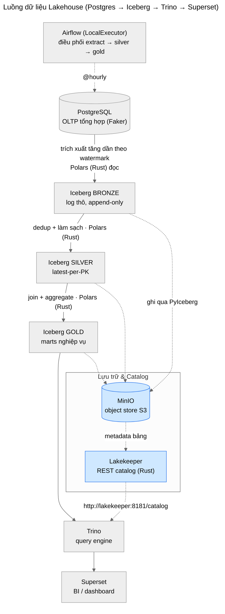
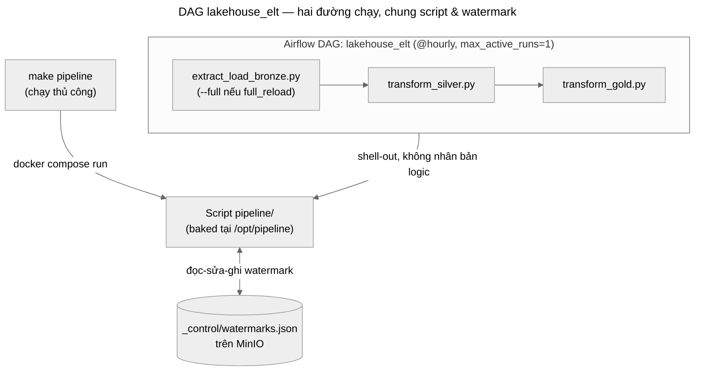

# Kiến trúc hệ thống

## Luồng dữ liệu đầu-cuối



> 🟧 Tô cam = thành phần Rust (Lakekeeper). Polars (Rust) là engine đọc/biến đổi trên các
> cạnh mũi tên. Mũi tên nét đứt = lưu trữ/metadata; nét liền = luồng biến đổi dữ liệu.

### Phiên bản ASCII (dự phòng khi không render được Mermaid)

```
PostgreSQL (OLTP tổng hợp, Faker)
   │  trích xuất tăng dần theo watermark  ── Polars (Rust) đọc
   ▼
Iceberg BRONZE (log thô, append-only)        MinIO (object store S3)
   │  Polars (Rust) dedup + làm sạch          catalog: Lakekeeper (REST, Rust)
   ▼                                          ghi:     PyIceberg
Iceberg SILVER (latest-per-PK)
   │  Polars (Rust) join + aggregate
   ▼
Iceberg GOLD (marts) ──► Trino ──► Superset
   ▲
Airflow (LocalExecutor) điều phối: extract → silver → gold
```

## Mô hình medallion (3 tầng)

| Tầng | Namespace | Tính chất | Việc thực hiện |
|------|-----------|-----------|----------------|
| **Bronze** | `bronze` | Thô, **append-only** | Append delta từ Postgres, không dedup |
| **Silver** | `silver` | Sạch, latest-per-PK | Dedup theo `updated_at`, lọc dòng rác, `overwrite` |
| **Gold** | `gold` | Marts nghiệp vụ | Join + aggregate, `overwrite` |

**Marts tầng gold** (`pipeline/transform_gold.py`):
`daily_revenue`, `revenue_by_category`, `top_customers`, `order_status_funnel`.

```mermaid
---
title: Mô hình Medallion — bronze → silver → gold
config:
  theme: neutral
---
flowchart LR
    subgraph B["🥉 BRONZE — thô, append-only"]
        b1["customers"]
        b2["products"]
        b3["orders"]
        b4["order_items"]
    end
    subgraph S["🥈 SILVER — sạch, latest-per-PK"]
        s1["customers"]
        s2["products"]
        s3["orders"]
        s4["order_items"]
    end
    subgraph G["🥇 GOLD — marts nghiệp vụ"]
        g1["daily_revenue"]
        g2["revenue_by_category"]
        g3["top_customers"]
        g4["order_status_funnel"]
    end
    B -->|"dedup_latest() + lọc rác · overwrite"| S
    S -->|"join + aggregate · overwrite"| G
```



**Vì sao bronze append-only mà không cần upsert:** việc thu gọn về trạng thái hiện tại
(latest-per-PK) được dồn xuống tầng silver bằng `dedup_latest()` — sort theo `updated_at`
rồi `unique(keep="last")`.

## Cơ chế incremental theo watermark

- File điều khiển: `_control/watermarks.json` trên bucket `warehouse` (MinIO).
- Mỗi bảng có `watermark_col` (= `updated_at`). Mỗi lần chạy:
  1. Đọc watermark cũ của bảng (mặc định epoch nếu chưa từng nạp).
  2. `SELECT * FROM <table> WHERE updated_at > '<watermark>'::timestamptz`.
  3. Append delta vào bronze, rồi cập nhật watermark = max(`updated_at`) của delta.
- **An toàn:** giá trị watermark được validate là timestamp hợp lệ trước khi nội suy vào
  SQL (đóng biên tin cậy trên mệnh đề WHERE). Mỗi bảng được cô lập: một bảng lỗi không làm
  hỏng các bảng khác và **không** đẩy watermark của nó (sẽ thử lại lần sau).
- **Tránh tranh chấp:** watermark là thao tác đọc-sửa-ghi một object JSON, nên Airflow đặt
  `max_active_runs=1` để không có 2 lần chạy đồng thời làm mất cập nhật.

## Thành phần catalog & lưu trữ

- **Lakekeeper** (REST catalog, Rust) quản lý metadata bảng Iceberg, lưu trên `meta-db`.
- **MinIO** lưu file Parquet + metadata Iceberg trong bucket `warehouse`.
- Cả **pipeline (PyIceberg)** và **Trino** đều dựng catalog giống hệt nhau qua
  `http://lakekeeper:8181/catalog` → một nguồn sự thật duy nhất.

## Mạng & triển khai (Docker Compose)

- Tất cả service nằm trên một mạng bridge `lakehouse`, gọi nhau bằng **service DNS**
  (`minio:9000`, `lakekeeper:8181`, `source-db`, `meta-db`) — **không** dùng `localhost`.
- **Profiles:**
  - mặc định: hạ tầng lõi (MinIO, Lakekeeper, Trino, các Postgres).
  - `pipeline`: container chạy ELT, tự bật khi `docker compose run`.
  - `full`: bật thêm Airflow + Superset.
- Pipeline chạy **bên trong** mạng lakehouse nên dùng đúng endpoint service-DNS mà
  Lakekeeper công bố → không lệch endpoint host-vs-container.

## Cổng dịch vụ (host)

| Dịch vụ | Cổng | Ghi chú |
|---------|------|---------|
| MinIO (API) | 9000 | object store S3 |
| Lakekeeper | 8181 | Iceberg REST catalog |
| Trino | 8080 | query engine |
| Airflow UI | 8082 | (8080 đã dành cho Trino) |
| Superset | 8088 | admin/admin |

## Mô hình thực thi chung

Điểm mấu chốt: **logic ELT không bị nhân bản.** Airflow DAG chỉ shell-out sang chính các
script trong `pipeline/` (đã baked vào image tại `/opt/pipeline`). Vì biến môi trường
(service-DNS, thông tin kết nối) được set ở docker-compose, nên chạy thủ công bằng `make`
và chạy qua Airflow **dùng chung hành vi và chung file watermark**.



## Tách vai trò Rust / Python (trung thực)

- **Rust gánh:** catalog (Lakekeeper) + đọc/biến đổi (Polars/DataFusion).
- **Python gánh:** ghi Iceberg (PyIceberg), BI (Superset), điều phối (Airflow).
- Lý do: tính tới 2026 chưa có đường **ghi** Iceberg thuần Rust mức production. Một hướng
  thay thế đã cân nhắc là DuckDB (xem `../poc-architecture.md`).
